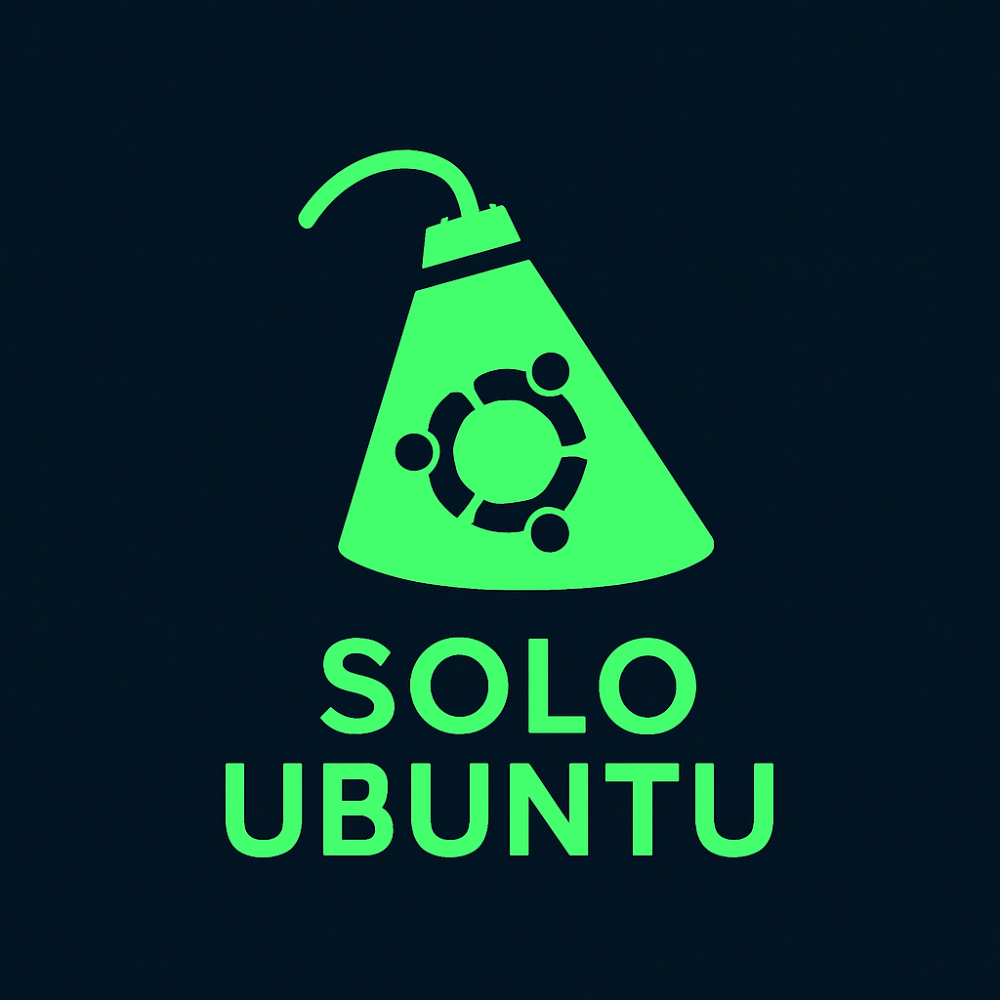
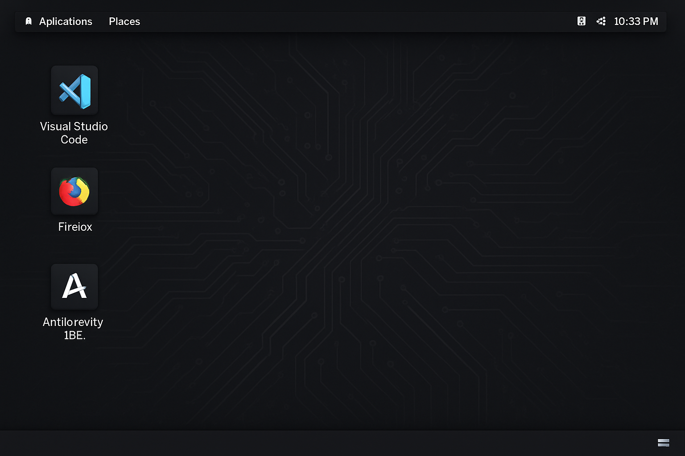

<p align="center">
  
</p>

# Solo Ubuntu: The Agentic Developer's Custom Distribution

**Solo Ubuntu** is a project that provides the necessary scripts and documentation to create a highly customized Ubuntu-based operating system image, tailored for the modern developer and power user. Inspired by the concept of "modded Ubuntu," this distribution focuses on pre-installing essential development tools, productivity applications, and cutting-edge AI-powered IDEs.

The core of this project is the `solo-ubuntu-setup.sh` script, which automates the installation and configuration of all included software on a fresh Ubuntu installation or within a chroot environment (a common step when building a custom ISO).

## Solo Ubuntu Desktop Preview

A preview of the XFCE4 desktop environment with the key applications installed:

<p align="center">
  
</p>

## Key Pre-installed Applications

This custom distribution is designed to be ready for development out-of-the-box, featuring:

| Application | Category | Purpose | Installation Method |
| :--- | :--- | :--- | :--- |
| **Google Antigravity IDE** | AI/Agentic Development | A next-generation, agent-first Integrated Development Environment (IDE) from Google. | Custom Script/Download |
| **Visual Studio Code** | Code Editor | A lightweight yet powerful source code editor from Microsoft. | APT Repository |
| **Mozilla Firefox** | Web Browser | A fast, private, and secure web browser. | APT Package |
| **Git** | Version Control | The industry-standard distributed version control system. | APT Package |
| **Docker** | Containerization | A platform for developing, shipping, and running applications in containers. | APT Repository |
| **htop** | System Utility | An interactive process viewer and system monitor. | APT Package |
| **VLC Media Player** | Multimedia | A highly portable multimedia player and framework. | APT Package |
| **XFCE4 Desktop** | GUI Environment | A lightweight desktop environment for graphical access. | APT Package |
| **TigerVNC Server** | Remote Access | A VNC server to connect to the GUI from a VNC client. | APT Package |

## How to Use This Project (Custom ISO)

This repository provides the *recipe* for Solo Ubuntu. To create your own custom ISO, you would typically follow these steps:

1.  **Start with a Base Ubuntu ISO:** Download a standard Ubuntu Desktop or Server ISO.
2.  **Use a Customization Tool:** Tools like **Cubic** (Custom Ubuntu ISO Creator) are recommended to extract the ISO contents.
3.  **Run the Setup Script:** Execute the `solo-ubuntu-setup.sh` script within the chroot environment provided by the customization tool.
    ```bash
    # Inside the chroot environment
    ./solo-ubuntu-setup.sh
    ```
4.  **Re-package the ISO:** Use the customization tool to re-package the modified files into a new, bootable Solo Ubuntu ISO.

***

## Installation in Termux (Android) with GUI

You can easily set up a Solo Ubuntu environment with a full graphical user interface (GUI) on your Android device using **Termux** and `proot-distro`. This method does not require root access.

### 1. Install Termux and Run the Installer Script

First, ensure you have the latest version of Termux installed (preferably from F-Droid or GitHub). Then, run the following commands in your Termux terminal:

```bash
# Install git and proot-distro
pkg update -y && pkg upgrade -y
pkg install proot-distro git -y

# Clone the Solo Ubuntu repository
git clone https://github.com/SoloFFCreator/solo-ubuntu.git
cd solo-ubuntu

# Run the Termux installer script
bash install-termux.sh
```

### 2. Log in to Ubuntu and Run the Setup Script

The `install-termux.sh` script will install the base Ubuntu system. Once it is complete, you will need to log in to the Ubuntu environment and run the main setup script to install the applications and the GUI environment.

```bash
# Log in to the Ubuntu environment
proot-distro login ubuntu

# Run the main setup script to install all applications (VS Code, Antigravity, XFCE4, VNC, etc.)
bash /root/solo-ubuntu-setup.sh
```

### 3. Set up and Start the GUI (VNC)

After the `solo-ubuntu-setup.sh` script finishes, the XFCE4 desktop and TigerVNC server will be installed. You can now set up your VNC password and start the server.

**A. Set VNC Password (First Time Only)**

The first time you run `vncserver`, it will prompt you to set a password for VNC access.

```bash
# Inside the Ubuntu environment
vncserver :1
```
*Follow the prompts to set a password (and optionally a view-only password). The server will start on display `:1` (port 5901).*

**B. Stop the Initial Server**

Stop the server that was automatically started after setting the password.

```bash
# Inside the Ubuntu environment
vncserver -kill :1
```

**C. Start the VNC Server**

Start the VNC server again. The `solo-ubuntu-setup.sh` script has already configured the `~/.vnc/xstartup` file to launch the XFCE4 desktop.

```bash
# Inside the Ubuntu environment
vncserver :1
```

### 4. Connect with a VNC Client

1.  **Download a VNC Client:** Install a VNC client application (e.g., VNC Viewer, RealVNC) on your Android device.
2.  **Connect:** In the VNC client, connect to the address: `localhost:5901`
3.  **Enter Password:** Use the password you set in step 3A.

You should now see the XFCE4 desktop environment running your Solo Ubuntu installation!

### 5. Launching Solo Ubuntu (CLI)

To access the command-line interface (CLI) of your Solo Ubuntu environment anytime:

```bash
proot-distro login ubuntu
```
